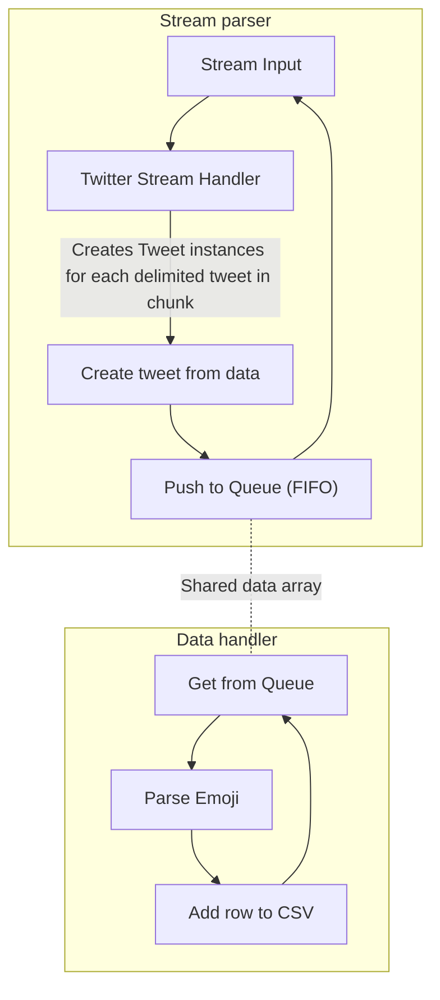
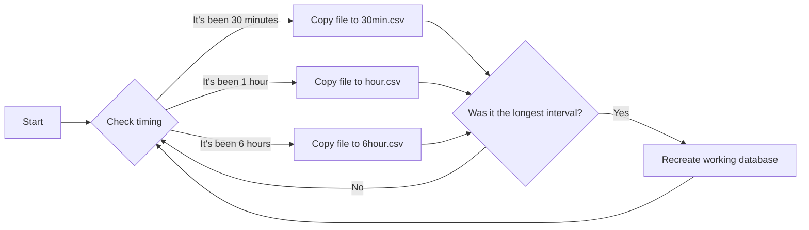

<!-- Note: This is a partial file meant to be imported. -->

<!-- # Project log

Here I will log my notes from my journey through the project. -->

## Day 1: Starting the project... by doing something else.

I started the project after seeing the Emoji tracker website displaying real time data about emoji usage on Twitter. This gave way to this project, made to test the hypothesis that emoji follow Zipf's law.

But I didn't really do anything *directly* aimed at the project. I instead started documenting my intentions first, padded with a bit of an explanation for what's what and what's happening. This in turn gave way to an overly long showcase of Zipf's law through character freqyency analysis and usage of Matplotlib - which finally I had a use of. I wanted to work with it quite badly after being first introduced to it. But learning *yet another Python library* takes time and took me away from actually starting building the project. Oh well...

## Day 2: Nodejs x Twitter themed allnighter

I am currently in Vietnam for unrelated matters and my plane back to France is at 8:30am, which, taking a 2 hour buffer just in case + driving there; I need to wake up at 4am tomorrow.  
Screw this "sleeping" thing, the flight will be a long 13 hours cramped in an Economy class seat and I will have time to sleep there.

Let's start writing some actual JS code!

Or should I say *TS code*, because I'm so fond of scrtict typing that I'm happy to add another compilation step just for it. Plus VS Code is awesome with TS.

I'm building the project with Node v8 and TS v2.5. Nodejs stuff is still new to me so I'm bound to making mistakes.

Wish me luck...

### Actually coding...

... But only after forcing Git to get his act together. Wasted time for nothing trying to sync the project to GitHub. Oh well, I have (half of) my night for myself.

Let's start by defining the processing classes first, this way I can save the headaches of OAuth2 for later.

This is how I want to do things: basically, you need to process the input stream as fast as possible in order to cop with the amount of information and not queue items on Twitter side (and eventually end up being shut out). I want to implement a multi-process setup but first we'll do it by separating the reading stream from the processing stream.

This system decouples the parsing and the processing - and the shared data array could easily be atomic. 

But I also want snapshots from different running lengths (30 minutes, 1 hour and 6 hours) from which I could derive data from. This can be done like this:

This allows the snapshots to remain available until overwritten, and for the data to be able to continuously be written.

Deleting and recreating the file might take some time, and several tweets might have been uploaded in the meantime. I can see two solutions for this:

1. Explicitely hold from consuming the queue while waiting for the file to be available again.
1. Be careless about the lost tweets.

The first solution might appear good to a perfectionist - but here the goal is to collect data about emoji usage, not about Twitter itself; therefore I can accept losing Tweets for a few seconds. This is the reason I won't add the REST API for times when the tweets don't come through completely - loss of information is okay, only the tally matters, in the end.